# 系统架构图册

这份文档只做一件事:**把散在各处的流程画出来**。

它不重复任何别处已有的事实。每张图下面都注明了它对应的代码位置 ——
图和代码不一致时**以代码为准**,并请顺手修图。

> **为什么是 SVG 而不是 PNG。**
> 这个仓库有过一张 5.8MB 的图混进交付包的事故(`tools/pack.sh` 里的 `IMAGE_FREE_DIRS`
> 数组就是那次留下的),而 `.gitattributes` 把 `*.png` 标成 binary —— 图片改了在评审里
> 是一行「Binary files differ」,看不出改了什么。SVG 是纯文本:进 patch、能 diff、
> 能在评审里逐行看,交付包不加一个字节的二进制,GitHub / GitLab / VS Code 均原生渲染。
> 想在一页里连着看完全部图,打开 [`docs/overview.html`](overview.html)(单文件,双击即开)。

| # | 这张图回答什么 |
| --- | --- |
| [1](#1-系统总览) | 起来之后有哪几个进程,各自连着什么 |
| [2](#2-一张图看懂整条流水线) | 商品资料进来,图片 URL 出去,中间经过什么 |
| [3](#3-轮级决策什么时候重生什么时候找人) | A/B/C/D 各自的后果,什么时候才轮到人 |
| [4](#4-生成任务状态机) | 17 个状态之间允许怎么走 |
| [5](#5-领域模型spu--颜色变体--sku) | 事实、素材、图片集分别挂在谁身上 |
| [6](#6-provider-错误策略) | 一次失败之后,重试、换家还是找人 |
| [7](#7-一次视觉评分调用的生命周期) | 花钱的那一次调用,留下了什么 |
| [8](#8-请求预算拟合与压缩阶梯) | 图片太大时怎么压,压不下去怎么办 |
| [9](#9-运行日志与密钥) | 一条日志有几个去向,密钥怎么不泄 |
| [10](#10-提示词注册表) | 八处提示词,哪几处改了会生效 |
| [11](#11-配置怎么生效) | 后台设置页与 .env 谁说了算 |
| [12](#12-运营的一天) | 七步流程,以及「唯一的下一步」怎么算出来 |
| [13](#13-交付包的三道闸) | 什么东西不许进包,谁在拦 |

---

## 1. 系统总览

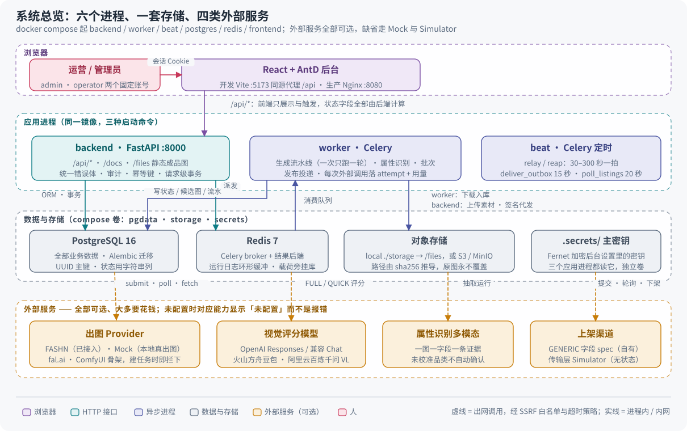

`docker compose` 起六个服务,其中 backend / worker / beat 是**同一个镜像的三种启动命令** ——
它们构造同一份 `Settings`,所以配置缺项会让三个一起起不来,而不是只坏一个。

**worker 挂掉是最隐蔽的故障**:接口一切正常,创建任务返回 201,只是永远不动。
`make worker-ping` 是判断它死活最快的方式。

**外部依赖全部可选。** 一个都没配时系统照常启动:Provider 显示「未配置」,
评分走 Mock,整条闭环跑通。

代码:`docker-compose.yml`、`docker-compose.prod.yml`、`backend/app/main.py`、
`backend/app/tasks/celery_app.py`。

---

## 2. 一张图看懂整条流水线

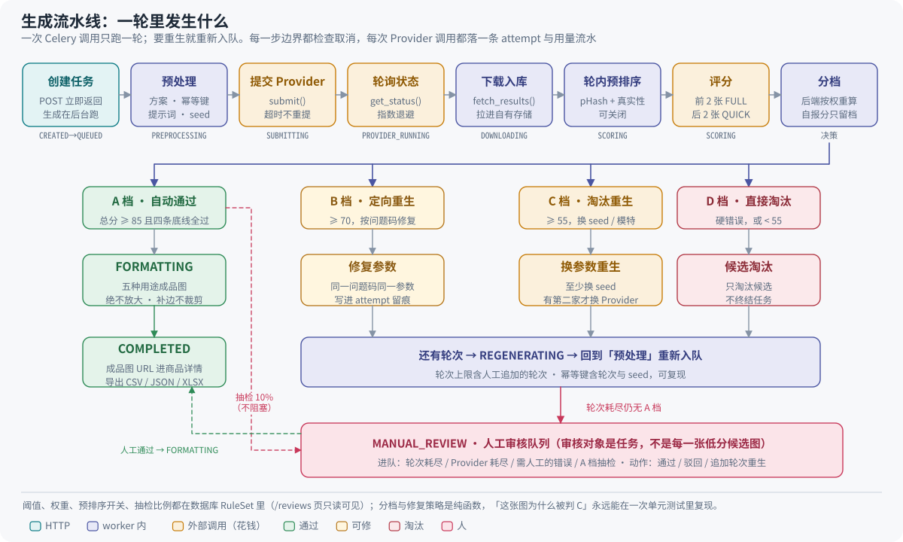

一次 Celery 调用**只跑一轮**。要重生时先提交事务,再把自己重新投进队列,
而不是在一个 worker 里循环跑三轮 —— 长事务会让取消失效、失败无法从中途恢复,
而且一轮的失败会连坐已经落库的前几轮。

这条链上唯一会花钱的两处是 Provider 调用与视觉评分调用。每次调用都落一条
`GenerationAttempt` 和一条用量流水,每个步骤边界都检查 `cancel_requested`。

三条规则值得单独强调:

**总分由后端按权重算,不采信评分器自报的数字。** 两者差值存进 `model_reported_overall`,
用来监控大模型打分漂移。Mock 评分器故意自报一个不同的数,等于给这条规则内置了活体探针。

**硬错误只淘汰候选,不终结任务。** 只要还有轮次,任务就继续自动重生,**不立刻交给人工**。
人工审核的对象是**商品任务**,不是每一张低分候选图 —— 否则队列会被本可自动解决的废图淹没。

**A 档要同时过四条底线**(见下一节)。

代码:`app/tasks/generation_tasks.py`(编排)、`app/services/generation_service.py`、
`app/services/evaluation_service.py`、`app/services/output_service.py`。

---

## 3. 轮级决策:什么时候重生,什么时候找人

### A 档要同时过四条底线

总分高**不等于** A 档。以下几项缺一不可:

| 底线维度 | 门槛 | 为什么单列 |
| --- | --- | --- |
| 总分 | ≥ 85 | 综合水平 |
| 商品身份一致性 | ≥ 90 | 图上是不是**这一件**衣服 |
| 结构一致性 | ≥ 90 | 版型、部件没有被改 |
| 人体真实性 | ≥ 85 | 手指、肢体、比例 |
| 网站可用性 | ≥ 85 | 能不能直接挂上商详页 |

> 总分 96 但商品身份 88 的图**判不到 A**。这条规则的意义是:
> 一张「整体很漂亮但衣服不是这件」的图,永远不能自动上线。

阈值、权重、预排序开关、抽检比例都在数据库的 `RuleSet` 里,`/reviews` 页可只读查看。

### 硬错误代码:出现任意一条即判 D

`app/core/enums.HardFailCode` 按受众分组。**条数不写在这里** —— 它每加一条就会
让这句话过期;要当前清单直接看那个枚举。

| 组 | 代码 |
| --- | --- |
| 商品身份 | `GARMENT_WRONG`、`SKU_IMAGE_MISMATCH`、`COLOR_VARIANT_WRONG` |
| 部件与形制(通用) | `GARMENT_PART_MISSING`、`GARMENT_PART_ADDED` |
| 女装专属 | `STRAP_CHANGED`、`NECKLINE_CHANGED`、`BACK_STYLE_CHANGED`、`COVERAGE_CHANGED` |
| 男装专属 | `WAISTBAND_CHANGED`、`INSEAM_CHANGED`、`LINER_CHANGED` |
| 图案与标识 | `PATTERN_DISTORTED`、`LOGO_OR_TEXT_CHANGED` |
| 人体与成像 | `ANATOMY_HARD_ERROR`、`FACE_HARD_ERROR`、`IMAGE_CORRUPTED`、`PRODUCT_SEVERELY_OCCLUDED` |
| 生成缺陷 | `ASYMMETRY_INTRODUCED`、`FUSION_DEFECT` |
| 受众 | `AUDIENCE_MISMATCH` |

后两组值得单独解释:它们**不能用 `GARMENT_WRONG` 顶替**。那条码的语义是「模型画的
不是这件衣服」,对策是换 seed / 换 Provider;而「衣服是对的、渲染塌了」和「商品对、
穿的人不对」这两类,对策分别是换模特模板、降低融合强度、核对商品受众。
`repair.py` 的定向重生策略正是按码选方向的 —— 混进 `GARMENT_WRONG`,一件左右不对称
的正确泳衣会被反复换 seed 重生,而每一轮都是真实付费调用。

启用哪些码由**受众**与规则包决定,本次评分启用的集合经 `rule_set` 传进评分器。

代码:`app/evaluators/rules.py`(分档)、`app/evaluators/decision.py`(轮级决策)、
`app/evaluators/repair.py`(修复策略)—— 三者都是**纯函数**,不碰数据库、不发网络请求。
「这张图为什么判 C」永远能在一次不带数据库的单元测试里复现。

---

## 4. 生成任务状态机

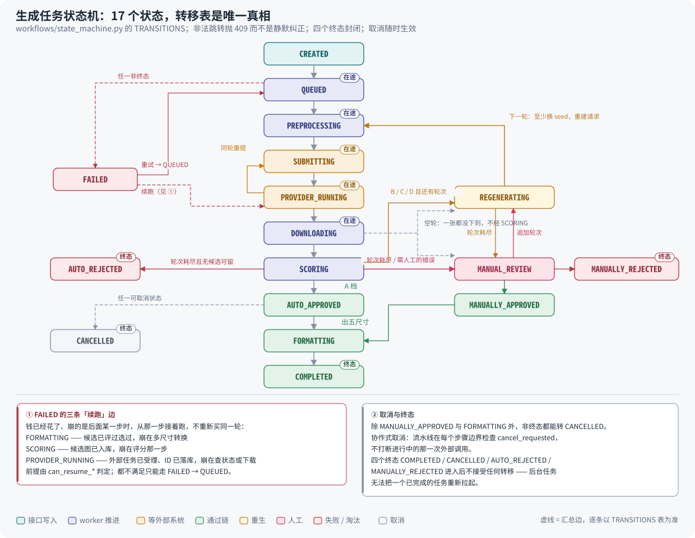

转移表 `TRANSITIONS` 是**唯一真相源**,任何状态写入都必须先过 `assert_can()`。
非法跳转抛 409 而不是静默纠正 —— 静默纠正会让线上问题变成「数据莫名其妙」,无法排查。

状态存库用字符串而非数据库枚举:状态机迭代频繁,加一个状态不该触发一次迁移。

代码:`app/workflows/state_machine.py`、`app/core/enums.py` 的 `TaskStatus`。

---

## 5. 领域模型:SPU → 颜色变体 → SKU

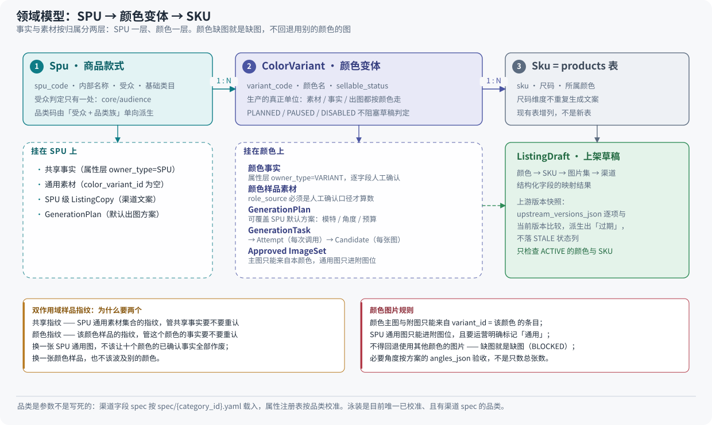

**颜色是生产的真正单位。** 素材、事实、出图、图片集都按颜色走;SKU(尺码)不重复
生成文案,也不单独出图。

**双作用域样品指纹**是这套模型能增量工作的关键:换一张 SPU 通用图不该让十个颜色的
已确认事实全部作废,换一张颜色样品也不该波及别的颜色。

代码:`app/models/spu.py`、`app/models/product.py`、`app/attributes/scope_fingerprint.py`、
`app/listings/image_set_service.py`,规格原文见 PRD v3.1.1 §4。

---

## 6. Provider 错误策略

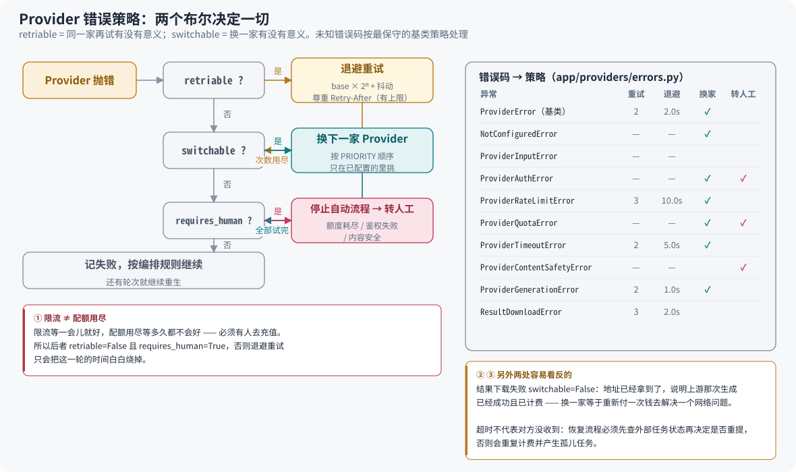

不同的失败,处理方式完全不同。两个布尔决定一切:`retriable`(同一家再试有没有意义)、
`switchable`(换一家有没有意义)。未知错误码按**最保守**的基类策略处理(`policy_for()`)。

代码:`app/providers/errors.py`、`app/providers/registry.py`。

---

## 7. 一次视觉评分调用的生命周期

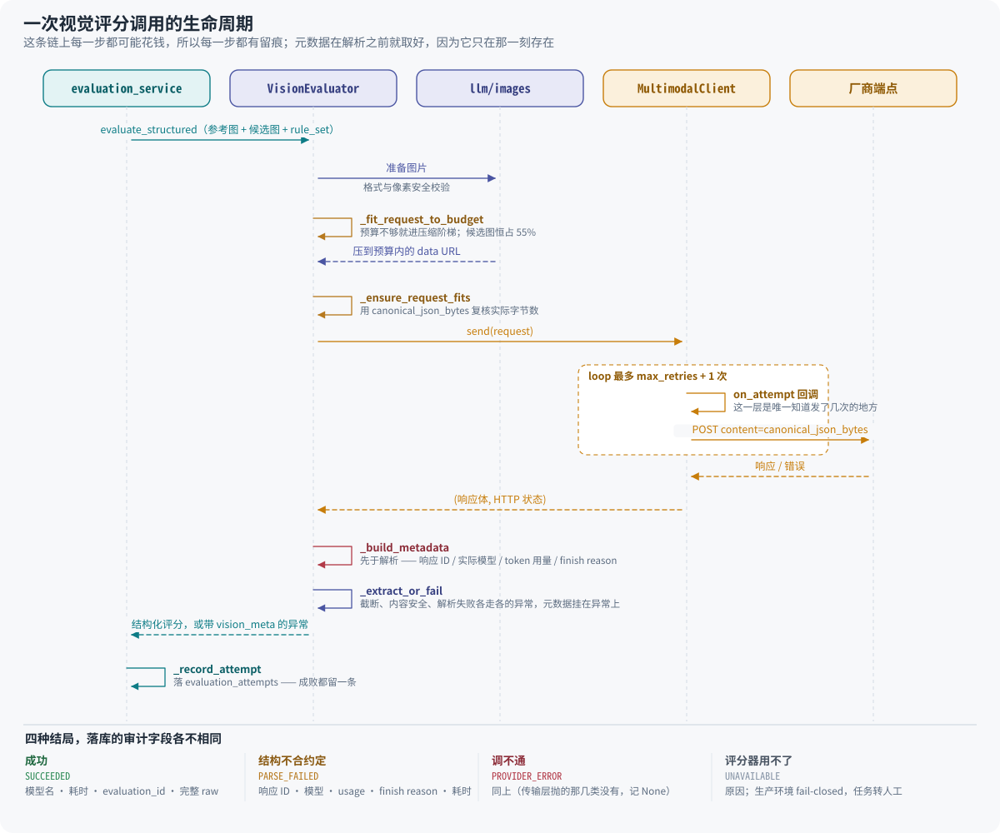

### 为什么元数据在解析**之前**就取好

截断和解析失败都是**已经计费的成功 HTTP 调用** —— 响应 ID、厂商实际路由到的模型、
token 用量、finish reason 全都拿得到,而它们**只在这一刻存在**。异常一抛,如果不挂在
异常上,`evaluation_attempts` 里那条失败记录就只剩一句错误说明:一张专门为了留痕而
建的表,在最需要留痕的场景里什么都没留下。

一套代码四种后端(OpenAI Responses / OpenAI 兼容 Chat Completions / 火山方舟豆包 /
阿里云百炼千问 VL),按 `VISION_MODEL_API_STYLE` 分适配器;生产环境 fail-closed ——
配了真实评分器却用不了时抛 `EvaluatorUnavailableError`,任务转人工审核,**绝不静默
退回 Mock**(Mock 按文件指纹给分,真实商品图有相当比例会被判成 A 档)。

代码:`app/evaluators/vision.py`、`app/llm/transport.py`、`app/services/evaluation_service.py`。
配置见 [`VISION-EVALUATOR.md`](VISION-EVALUATOR.md)。

---

## 8. 请求预算拟合与压缩阶梯

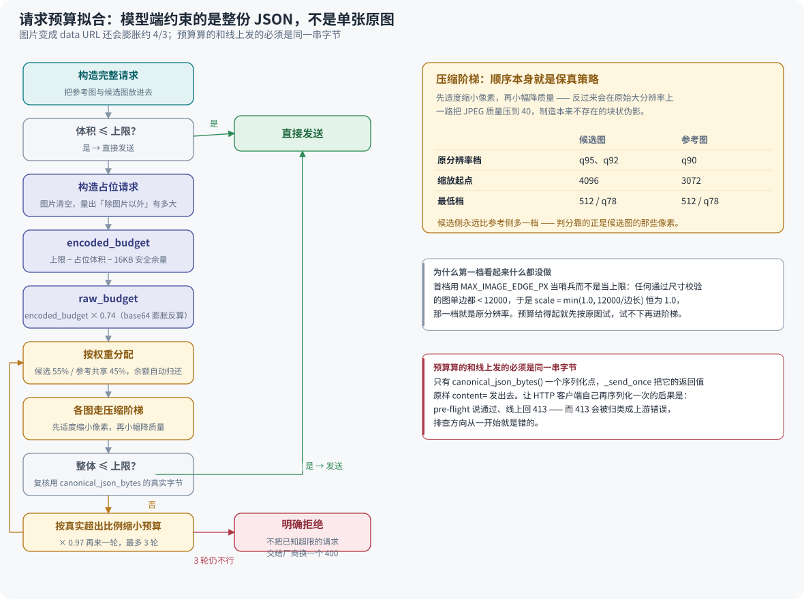

模型端约束的是**整份 JSON**,不是单张原图。图片变成 data URL 还会膨胀约 4/3,
所以「这张图 3MB,上限 20MB,够了」这种算法从一开始就是错的。

代码:`app/llm/images.py`(阶梯)、`app/evaluators/vision.py`(拟合)、
`app/llm/transport.py`(序列化)。

---

## 9. 运行日志与密钥

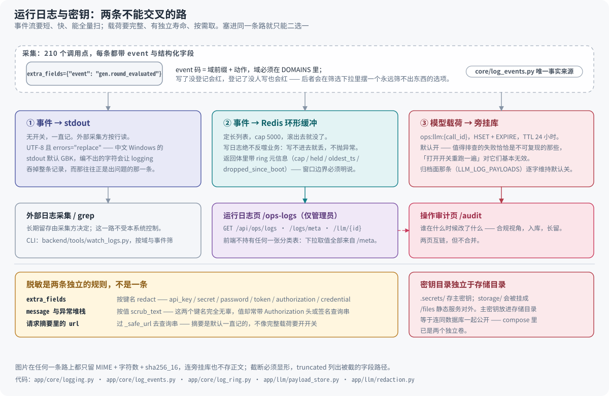

日志的**采集**是健康的,这套设计只动采集之后的三件事:归类、展示、原文。

**归类不能靠英文句子。** 上一版的查看器硬编码了 9 条消息原文当过滤集,
措辞一改就**安静漏事件** —— 不报错、不提示,就是少了。现在 `event` 码是机器可读的
分类,域必须登记在 `DOMAINS` 里,守卫**双向**比对:写了没登记会红,登记了没人写
**也会红**(后者会在筛选下拉里摆一个永远筛不出东西的选项,而运营会以为是「这段时间
没发生」,不是「这个码是假的」)。

**审计页与运行日志页不合并。** 审计回答「谁在什么时候改了什么」——合规、入库、长留;
运行日志回答「系统怎么跑的」——排障、环形、短留。合并的结果是运营在合规页里看见
租约让位,谁都不舒服。

代码:`app/core/log_events.py`、`app/core/log_ring.py`、`app/llm/payload_store.py`、
`app/api/ops_logs.py`、`app/core/logging.py`、`app/llm/redaction.py`。
设计原文见 [`LOG-CONSOLE.md`](LOG-CONSOLE.md)。

---

## 10. 提示词注册表

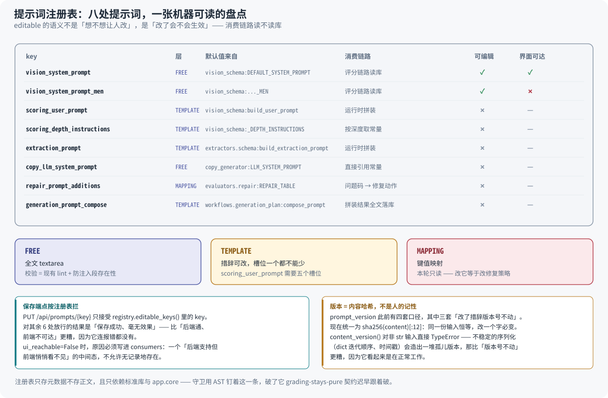

仓库里的提示词散在六个模块里。在注册表之前,只有第一处能在界面上看到,
其余几处的存在只写在一份 PRD 的表格里 —— 表格不会在新增一处时变红,
也答不出「这个 key 的默认值还解析得出来吗」。

**`editable` 的语义不是「想不想让人改」,是「改了会不会生效」。** `prompt_templates`
表谁都能写,但只有评分那两份的消费链路会读库;其余几处的正文由代码拼装或直接引用常量,
库里存一版新的,链路一个字都不会读。把它们标成可编辑,得到的是「保存成功、毫无效果」——
比「后端通、前端不可达」更糟,因为它连报错都没有。

代码:`app/prompts/registry.py`、`app/prompts/versioning.py`、`app/api/prompts.py`。
详见 [`subsystems/prompts.md`](subsystems/prompts.md)。

---

## 11. 配置怎么生效

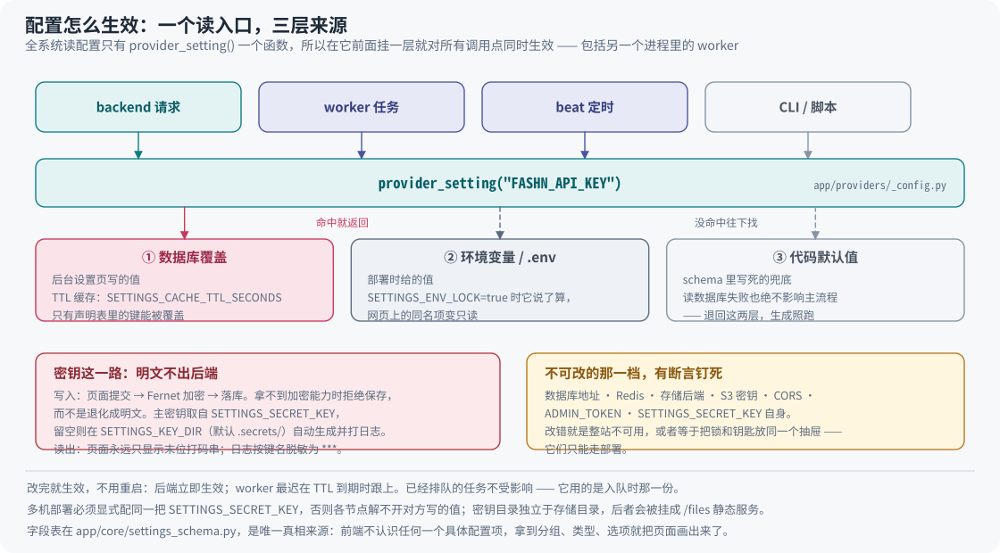

全系统读配置只有 `provider_setting()` 一个函数,所以只在它前面挂一层带 TTL 缓存的
数据库覆盖层,设置页就对**所有**调用点同时生效,包括另一个进程里的 Celery worker。

三条刻意的约束:读失败绝不影响主流程(数据库连不上就退回环境变量,生成任务照跑);
只缓存不监听(少一个会坏的组件,代价是 worker 最多晚 TTL 秒看到新值);
只有声明表里的键能被覆盖(数据库里就算被塞进 `DATABASE_URL` 也不会生效)。

代码:`app/providers/_config.py`、`app/core/settings_schema.py`、`app/services/settings_runtime.py`。
取舍见 [`SETTINGS.md`](SETTINGS.md)。

---

## 12. 运营的一天

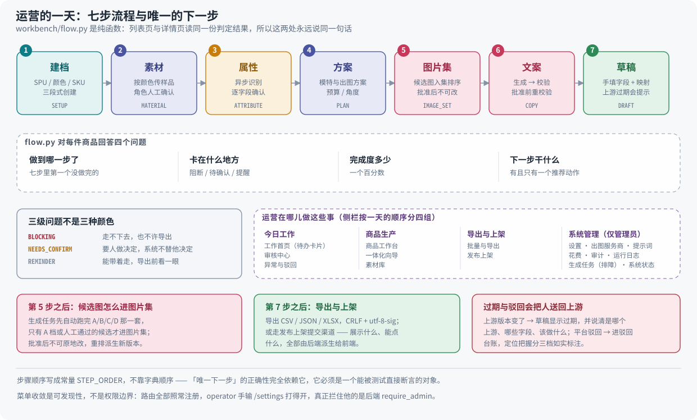

`workbench/flow.py` 是**零依赖纯函数**:列表页与详情页读同一份判定结果,
所以这两处永远说同一句话 —— 这是任务书里「商品列表与详情页状态一致」那条退出条件
唯一可靠的做法。

它在纯函数层而不是 service 层,是因为「缺背面图时下一步是不是补素材」这类判断需要
被穷举测试,而只要它能查库,就没人会写那个穷举测试。

页面与接口的逐项说明见 [`user/guide.md`](user/guide.md)。

---

## 13. 交付包的三道闸

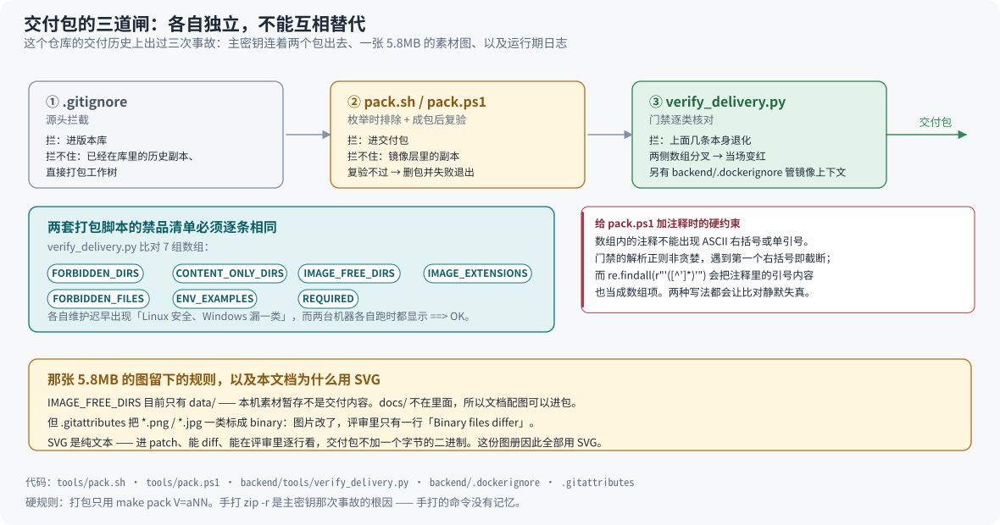

三道闸各自独立,**不能互相替代**。`.gitignore` 拦不住直接打包工作树,
打包脚本拦不住镜像层里的副本,而 `verify_delivery.py` 拦的是「上面几条本身退化」。

**两套打包脚本的禁品清单必须逐条相同。** 各自维护迟早会出现「Linux 安全、Windows 漏
一类」,而两台机器各自跑的时候都显示 `==> OK`。

代码:`tools/pack.sh`、`tools/pack.ps1`、`backend/tools/verify_delivery.py`、
`backend/.dockerignore`、`.gitattributes`。

---

## 图与代码不一致时

**以代码为准,然后改图。** 图的源码是 `docs/assets/` 下的 SVG,纯文本,可以直接编辑;
成套重排时保持同一套配色与字号约定。

这份文档刻意不写任何「数量」类事实(多少条用例、多少个接口、多少个配置分组、
多少条硬错误代码)—— 那类数字每批都在变,写进散文就是在制造一份会静默过期的第二真相。
需要当前口径时跑对应的命令,别在这里找。
