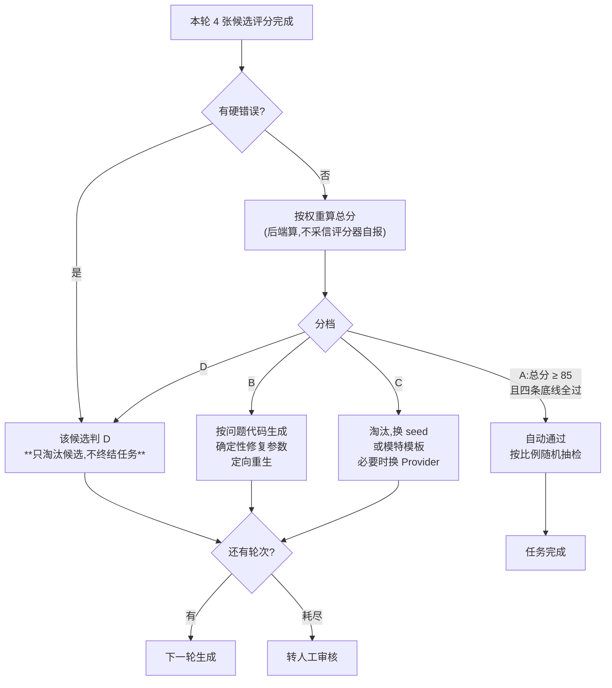
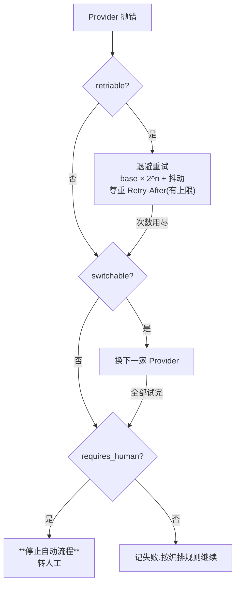
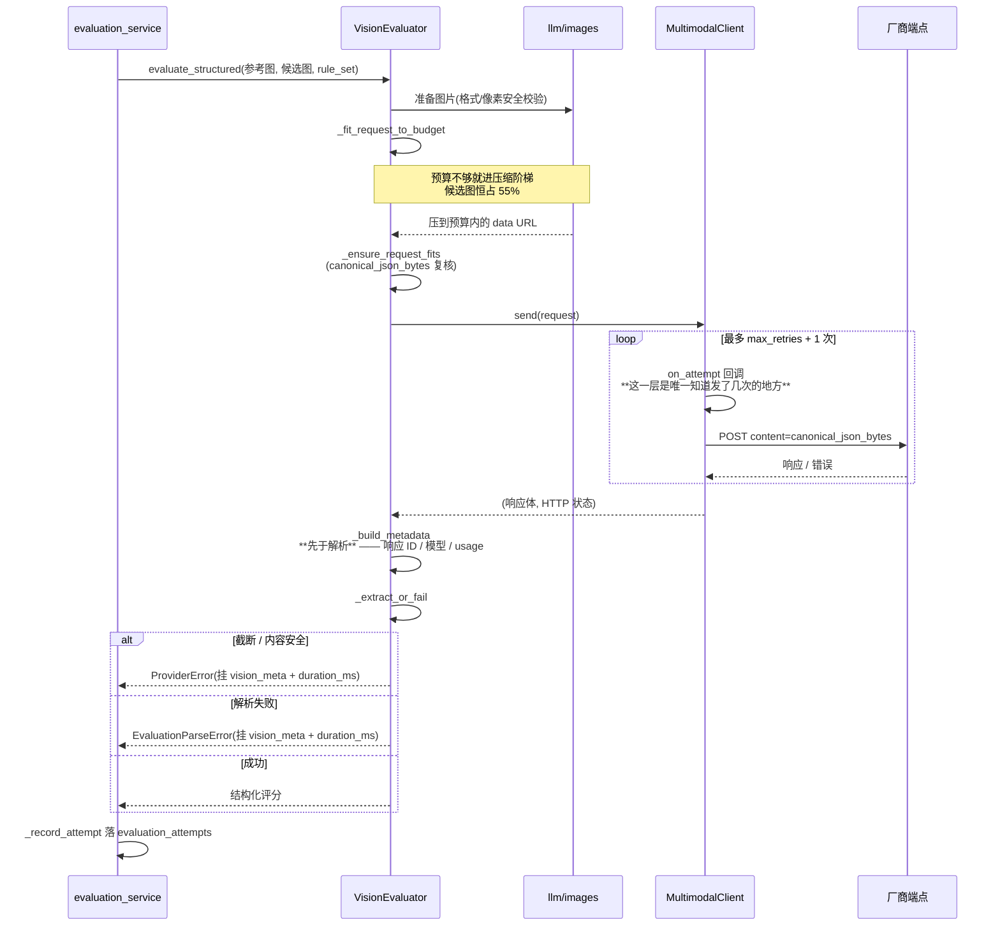
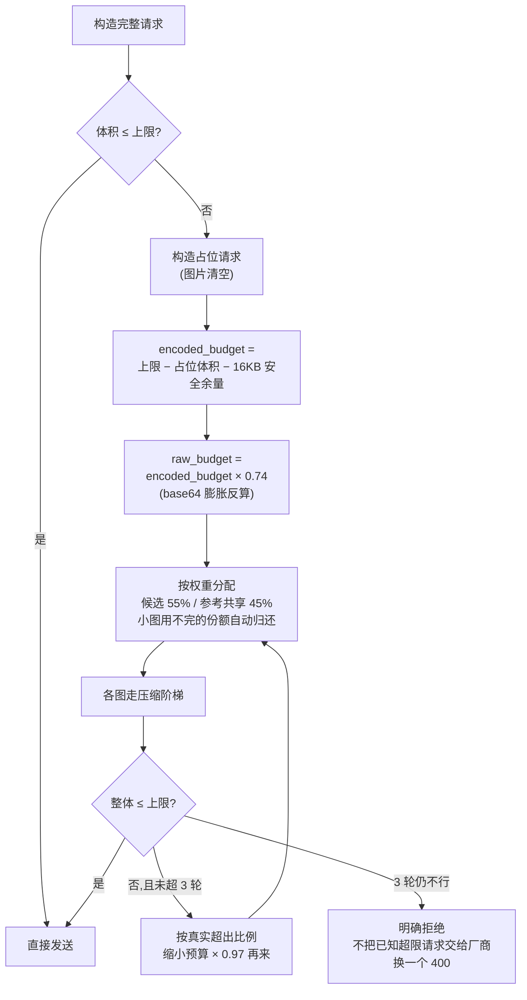
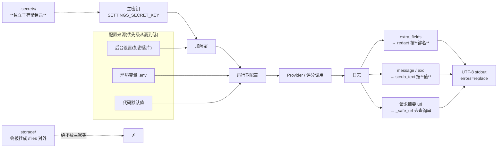
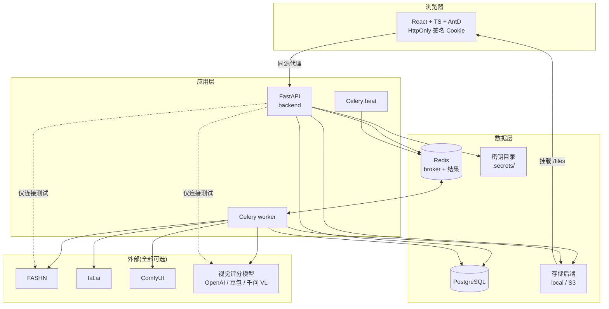
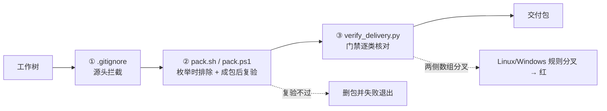

# 系统架构图册

这份文档只做一件事:**把散在各处的流程画出来**。

它不重复任何别处已有的事实。每张图下面都注明了它对应的代码位置 ——
图和代码不一致时**以代码为准**,并请顺手修图。

> **为什么是 Mermaid 而不是 PNG。**
> 这个仓库有过一张 5.8MB 的图混进交付包的事故(`tools/pack.sh` 里的
> `IMAGE_FREE_DIRS` 数组就是那次留下的),而 `.gitattributes` 把 `*.png` 标成
> binary —— 图片改了在评审里是一行 "Binary files differ",看不出改了什么。
> Mermaid 是纯文本:进 patch、能 diff、能在评审里逐行看,交付包不加一个字节的二进制。
> GitHub / GitLab / VS Code 均原生渲染。

---

## 1. 一张图看懂整条流水线

从商品资料进来,到网站可用的图片 URL 出去。

```mermaid
flowchart LR
    subgraph IN["① 建档与素材"]
        A1["SPU / 颜色变体 / SKU<br/>三步建档"]
        A2["上传原图<br/>sha256 去重"]
        A3["属性识别<br/>+ 人工校准"]
    end

    subgraph GEN["② 生成"]
        B1["生成方案<br/>解析当前生效的那一份"]
        B2["Provider 派发<br/>mock / fashn / fal / comfyui"]
        B3["每轮 4 张候选"]
    end

    subgraph EVAL["③ 评分与决策"]
        C1["轮内预排序<br/>感知哈希 + 真实性代理"]
        C2["前两名完整评分<br/>后两名快速硬错误检查"]
        C3["A / B / C / D 分档"]
        C4{"轮级决策"}
    end

    subgraph OUT["④ 出图与上架"]
        D1["五个尺寸版本"]
        D2["导出 JSON / CSV"]
        D3["发布上架"]
    end

    HUMAN["人工审核队列<br/>对象是**任务**,不是每张废图"]

    A1 --> A2 --> A3 --> B1 --> B2 --> B3 --> C1 --> C2 --> C3 --> C4
    C4 -->|"A 档"| D1
    C4 -->|"还有轮次"| B2
    C4 -->|"轮次耗尽仍无 A 档"| HUMAN
    HUMAN -->|"人工通过"| D1
    HUMAN -->|"追加轮次"| B2
    HUMAN -->|"驳回"| END["任务终态"]
    D1 --> D2 --> D3
```

**这条链上唯一会花钱的两处**是 `②` 的 Provider 调用和 `③` 的视觉评分调用。
Mock Provider 与 Mock 评分器让整条闭环在**零外部依赖**下跑通 —— 但 Mock 评分器
按文件指纹给分,不能用来决定图片上不上网站。

代码:`app/workflows/`(编排)、`app/services/generation_service.py`、
`app/services/evaluation_service.py`、`app/services/output_service.py`。

---

## 2. 轮级决策:什么时候重生,什么时候找人

上面那张图里的 `C4` 展开。**这是整个系统里最该看懂的一张图。**

### A 档要同时过四条底线

总分高**不等于** A 档。以下四项缺一不可:

| 底线维度 | 门槛 | 为什么单列 |
| --- | --- | --- |
| 总分 | ≥ 85 | 综合水平 |
| 商品身份一致性 | ≥ 90 | 图上是不是**这一件**衣服 |
| 结构一致性 | ≥ 90 | 版型、部件没有被改 |
| 人体真实性 | ≥ 85 | 手指、肢体、比例 |
| 网站可用性 | ≥ 85 | 能不能直接挂上商详页 |

> 总分 96 但商品身份 88 的图**判不到 A**。这条规则的意义是:
> 一张"整体很漂亮但衣服不是这件"的图,永远不能自动上线。

### 硬错误代码(18 项,按受众分组)

出现任意一条即判 D。`app/core/enums.HardFailCode`:

| 组 | 代码 |
| --- | --- |
| 商品身份 | `GARMENT_WRONG`、`SKU_IMAGE_MISMATCH`、`COLOR_VARIANT_WRONG` |
| 部件与形制 | `GARMENT_PART_MISSING`、`GARMENT_PART_ADDED`、`STRAP_CHANGED`、`NECKLINE_CHANGED`、`BACK_STYLE_CHANGED`、`COVERAGE_CHANGED`、`WAISTBAND_CHANGED`、`INSEAM_CHANGED`、`LINER_CHANGED` |
| 图案与标识 | `PATTERN_DISTORTED`、`LOGO_OR_TEXT_CHANGED` |
| 人体与成像 | `ANATOMY_HARD_ERROR`、`FACE_HARD_ERROR`、`IMAGE_CORRUPTED`、`PRODUCT_SEVERELY_OCCLUDED` |

启用哪些码由**受众**与规则包决定(女装 / 男装 / 通用三组),
本次评分启用的集合经 `rule_set` 的 `_enabled_hard_fail_codes` 传进评分器。

代码:`app/evaluators/rules.py`(分档)、`app/evaluators/decision.py`(轮级决策)——
两者都是**纯函数**,不碰数据库、不发网络请求。"这张图为什么判 C"
永远能在一次不带数据库的单元测试里复现。

---

## 3. Provider 错误策略矩阵

不同的失败,处理方式完全不同。两个布尔决定一切:
`retriable`(同一家再试有没有意义)、`switchable`(换一家有没有意义)。

| 异常 | 错误码 | HTTP | retriable | switchable | 重试 | 退避(秒) | 转人工 |
| --- | --- | --- | :---: | :---: | :---: | :---: | :---: |
| `ProviderError`(基类) | `PROVIDER_SERVICE_ERROR` | 502 | ✅ | ✅ | 2 | 2.0 | — |
| `NotConfiguredError` | `PROVIDER_NOT_CONFIGURED` | 409 | ❌ | ✅ | 0 | 0 | — |
| `ProviderInputError` | `INPUT_INVALID` | 422 | ❌ | ❌ | 0 | 0 | — |
| `ProviderAuthError` | `AUTH_FAILED` | 502 | ❌ | ✅ | 0 | 0 | ✅ |
| `ProviderRateLimitError` | `RATE_LIMITED` | 429 | ✅ | ✅ | 3 | 10.0 | — |
| `ProviderQuotaError` | `QUOTA_EXHAUSTED` | 402 | ❌ | ✅ | 0 | 0 | ✅ |
| `ProviderTimeoutError` | `NETWORK_TIMEOUT` | 504 | ✅ | ✅ | 2 | 5.0 | — |
| `ProviderContentSafetyError` | `CONTENT_SAFETY` | 422 | ❌ | ❌ | 0 | 0 | ✅ |
| `ProviderGenerationError` | `GENERATION_FAILED` | 502 | ✅ | ✅ | 2 | 1.0 | — |
| `ResultDownloadError` | `RESULT_DOWNLOAD_FAILED` | 502 | ✅ | ❌ | 3 | 2.0 | — |

三处容易看反的地方:

- **限流 vs 配额用尽。** 限流等一会儿就好,配额用尽等多久都不会好 —— 必须有人去充值。
  所以后者 `retriable=False` 且 `requires_human=True`,否则退避重试只会把这一轮的时间白白烧掉。
- **结果下载失败 `switchable=False`。** 地址已经拿到了,说明上游那次生成**已经成功且已计费**;
  换一家等于重新付一次钱去解决一个网络问题。
- **超时不代表对方没收到。** 恢复流程必须先查外部任务状态再决定是否重提,
  否则会重复计费并产生孤儿任务。

未知错误码按**最保守**的基类策略处理(`policy_for()`)。
代码:`app/providers/errors.py`。

---

## 4. 视觉评分调用:一次请求的完整生命周期

这条链上每一步都可能花钱,所以每一步都有留痕。

### 为什么元数据在解析**之前**就取好

截断和解析失败都是**已经计费的成功 HTTP 调用** —— 响应 ID、厂商实际路由到的模型、
token 用量、finish reason 全都拿得到,而它们**只在这一刻存在**。
异常一抛,如果不挂在异常上,`evaluation_attempts` 里那条失败记录就只剩一句错误说明:
一张专门为了留痕而建的表,在最需要留痕的场景里什么都没留下。

| 结局 | `EvaluationOutcome` | 落库的审计字段 |
| --- | --- | --- |
| 成功 | `SUCCEEDED` | 模型名、耗时、evaluation_id、完整 raw |
| 结构不合约定 | `PARSE_FAILED` | 响应 ID、模型、usage、finish reason、耗时 |
| 调不通(限流/超时/鉴权/额度/内容安全) | `PROVIDER_ERROR` | 同上(传输层抛的那几类没有,记 None) |
| 评分器根本用不了 | `UNAVAILABLE` | 原因 |
| 整轮失败已安排重评 | `ROUND_RETRY_SCHEDULED` | — |

代码:`app/evaluators/vision.py`、`app/llm/transport.py`、
`app/services/evaluation_service.py`。

---

## 5. 请求预算拟合与压缩阶梯

模型端约束的是**整份 JSON**,不是单张原图。图片变成 data URL 还会膨胀约 4/3。

### 阶梯的顺序本身就是保真策略

**先适度缩小像素,再小幅降质量** —— 反过来会在原始大分辨率上一路把 JPEG
质量压到 40,制造本来不存在的块状伪影。

| | 候选图 | 参考图 |
| --- | --- | --- |
| 原分辨率档 | q95、q92 | q90 |
| 缩放起点 | 4096 | 3072 |
| 最低档 | 512 / q78 | 512 / q78 |

首档用 `MAX_IMAGE_EDGE_PX` 当**哨兵**而不是当上限:任何通过了尺寸校验的图单边都
< 12000,于是 `scale = min(1.0, 12000/边长)` 恒为 1.0,那一档就是原分辨率。
预算给得起就先按原图试,试不下再进缩放阶梯。

> **候选侧永远比参考侧多一档。** 这是要守的不变量:同预算下候选图恒不小于参考图 ——
> 候选是被判分的那一张,判断纹理、走线和人体细节靠的正是那些像素。

**预算算的和线上发的必须是同一串字节。** 只有 `canonical_json_bytes()` 一个序列化点,
`_send_once` 把它的返回值原样 `content=` 发出去。让 HTTP 客户端自己序列化的后果是
pre-flight 说通过、线上回 413 —— 而 413 会被归类成上游错误,排查方向从一开始就是错的。

代码:`app/llm/images.py`(阶梯)、`app/evaluators/vision.py`(拟合)、
`app/llm/transport.py`(序列化)。

---

## 6. 密钥与日志:两条不能交叉的路

四条规则:

1. **密钥目录独立于存储目录。** 存储目录会被挂成 `/files` 静态服务,
   主密钥放进去等于连同数据库一起公开。
2. **键名脱敏管不到自由文本。** `redact` 按键名判定,而 `message` 和异常堆栈
   这两个键名完全无辜、值却是字符串 —— 堆栈里最常见的一行正是带 `Authorization`
   头或带签名查询串的请求信息。所以值级脱敏(`scrub_text`)是单独一条,不是同一条。
3. **请求摘要是默认一直记的**,不像完整 payload 要 `LLM_LOG_PAYLOADS=true` 才开。
   所以摘要里的 url 必须过 `_safe_url`。
4. **日志流必须 UTF-8 且 `errors="replace"`。** 中文 Windows 的 stdout 默认 GBK,
   遇到编不出的字符会抛 `UnicodeEncodeError`,而 logging 会吞掉它 —— **整条记录消失**,
   往往正是出问题的那一条。

代码:`app/core/logging.py`、`app/llm/redaction.py`、`app/services/settings_service.py`。

---

## 7. 部署形态与组件

**外部依赖全部可选。** 一个都没配时系统照常启动:Provider 显示"未配置",
评分走 Mock,整条闭环跑通。

**开发用 Vite 开发服务器,类生产用 Nginx 托管构建产物**
(`docker-compose.prod.yml`,前端监听 `127.0.0.1:8080`,backend 不再对外发布端口)。

**不要给前端配 `VITE_API_BASE_URL`** —— 那是绝对地址、由浏览器解析,
配上之后就只有 docker 宿主机本机能用了。前后端走 Vite 同源代理,不涉及 CORS。

---

## 8. 交付包的三道闸

这个仓库的交付历史上出过三次事故:主密钥连着两个包出去、一张 5.8MB 的素材图、
以及运行期日志。三道闸各自独立,**不能互相替代**。

| 闸 | 拦什么 | 拦不住什么 |
| --- | --- | --- |
| `.gitignore` | 进版本库 | 已经在版本库里的历史副本、直接打包工作树 |
| `pack.sh` / `pack.ps1` | 进交付包(枚举 + 成包后复验) | 镜像层里的副本 |
| `backend/.dockerignore` | 进镜像构建上下文 | 交付包 |
| `verify_delivery.py` | 上面几条本身退化 | — |

**两套打包脚本的禁品清单必须逐条相同。** `verify_delivery.py` 会比对 7 组数组
(`FORBIDDEN_DIRS` / `CONTENT_ONLY_DIRS` / `IMAGE_FREE_DIRS` / `IMAGE_EXTENSIONS` /
`FORBIDDEN_FILES` / `ENV_EXAMPLES` / `REQUIRED`)—— 各自维护迟早会出现
"Linux 安全、Windows 漏一类",而两台机器各自跑的时候都显示 `==> OK`。

> **给 `pack.ps1` 加注释时的硬约束:** 数组内的注释**不能出现 ASCII 右括号或单引号**。
> 门禁的解析正则非贪婪,遇到第一个右括号即截断;而 `re.findall(r"'([^']*)'")`
> 会把注释里的引号内容也当成数组项。两种写法都会让比对静默失真。

代码:`tools/pack.sh`、`tools/pack.ps1`、`backend/tools/verify_delivery.py`。

---

## 图与代码不一致时

**以代码为准,然后改图。** 这份文档刻意不写任何"数量"类事实(多少条用例、
多少个接口、多少个配置分组)—— 那类数字每批都在变,写进散文就是在制造一份
会静默过期的第二真相。需要当前口径时跑对应的命令,别在这里找。
