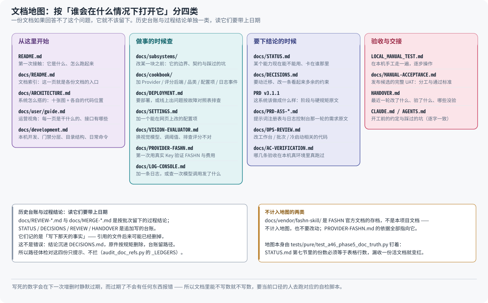

# 文档索引

这个仓库的文档按**「谁会在什么情况下打开它」**分类。一份文档如果回答不了这个问题,
它就不该留下。

## 从这里开始

| 文档 | 什么时候看 |
| --- | --- |
| [`README.md`](../README.md) | 第一次接触这个项目:它是什么、怎么跑起来 |
| [`ARCHITECTURE.md`](ARCHITECTURE.md) | 想看各条流程长什么样 —— 十三张图,每张都注明对应的代码位置 |
| [`overview.html`](overview.html) | 同一套图的单文件版本,双击打开,适合投屏与离线看 |
| [`user/guide.md`](user/guide.md) | 运营视角:每一页干什么、每一组接口干什么 |
| [`development.md`](development.md) | 本机开发、门禁分层、目录结构、日常命令 |

## 做事的时候查

| 文档 | 什么时候看 |
| --- | --- |
| [`subsystems/README.md`](subsystems/README.md) | 要改某一块代码之前:它的边界、契约与踩过的坑 |
| [`cookbook/README.md`](cookbook/README.md) | 要加一个 Provider / 评分后端 / 品类 / 配置项 / 日志事件 |
| [`DEPLOYMENT.md`](DEPLOYMENT.md) | 要部署,或线上出了问题按故障对照表排查。**Windows / macOS 看第十节** |
| [`SETTINGS.md`](SETTINGS.md) | 要加一个可在网页上改的配置项,或搞清楚某项「改了没反应」 |
| [`VISION-EVALUATOR.md`](VISION-EVALUATOR.md) | 要换视觉大模型、调阈值、或排查评分结果不对 |
| [`PROVIDER-FASHN.md`](PROVIDER-FASHN.md) | 要第一次用真实 Key 验证 FASHN,或排查它的报错与费用 |
| [`LOG-CONSOLE.md`](LOG-CONSOLE.md) | 要加一条日志、查一次模型调用发了什么、或搞清运行日志页与审计页各答什么 |
| [`log-console-prototype.html`](log-console-prototype.html) | 运行日志页的交互原型,单文件,双击打开 |

## 要下结论的时候

| 文档 | 什么时候看 |
| --- | --- |
| [`STATUS.md`](STATUS.md) | 某个能力现在能不能用、有哪些已知限制、下一步卡在谁那里 |
| [`DECISIONS.md`](DECISIONS.md) | 要动数据库迁移、要改一条看起来「多余」的约束、准备升级一个已在运行的部署 |
| [`swimwear_sample_to_listing_prd_v3_1_1.md`](swimwear_sample_to_listing_prd_v3_1_1.md) | 要对「这系统该做成什么样」下结论;全仓注释以 §N 指它 |
| [`PRD-A55-PROMPT-REGISTRY-AND-LOG-CONSOLE.md`](PRD-A55-PROMPT-REGISTRY-AND-LOG-CONSOLE.md) | 提示词注册表与日志控制台那一轮的需求原文 |
| [`OPS-REVIEW.md`](OPS-REVIEW.md) | 要改工作台 / 批次 / 冷启动 / 平台驳回相关的代码 |
| [`REVIEW.md`](REVIEW.md) | 要知道下一步该做什么 —— 施工方案,第 12 章任务表已标完成状态 |
| [`AC-VERIFICATION.md`](AC-VERIFICATION.md) | 哪几条验收在本机真环境里真跑过、哪几条没有 |
| [`REVIEW-A28-TRACKING.md`](REVIEW-A28-TRACKING.md) | a28 那份检视报告的阻断项现在还剩几条 |
| [`REVIEW-CODE-ISSUES-2026-08-21.md`](REVIEW-CODE-ISSUES-2026-08-21.md) | 要知道代码层面还欠着什么 —— 按 B/F/X 编号的问题清单。全部条目关闭后删除 |
| [`UPGRADING.md`](UPGRADING.md) | 要升级一个已在运行的部署:必须做的人工动作、会被挡下的操作、不报错的口径变更 |

## 验收与交接

| 文档 | 什么时候看 |
| --- | --- |
| [`../LOCAL_MANUAL_TEST.md`](../LOCAL_MANUAL_TEST.md) | 要在本机手工走一遍:启动、初始化、口令、浏览器登录六步验收、逐步操作 |
| [`MANUAL-ACCEPTANCE.md`](MANUAL-ACCEPTANCE.md) | 要做发布候选的完整 UAT:人员分工、两套库、五个阶段的通过标准与证据要求 |
| [`../HANDOVER.md`](../HANDOVER.md) | 最近一轮改了什么、验了什么、**哪些没验**。顶部是最新一轮 |
| [`../CLAUDE.md`](../CLAUDE.md) | 用 agent 开工前。写的是约定与指针,不是目录说明 |
| [`notes/README.md`](notes/README.md) | 想知道某个坑的全过程,或者查一轮历史快照与交接 |
| [`STYLE.md`](STYLE.md) | 要写或改文档:五条可判定的写作约定 |

## 两类不在上表里的东西

**历史台账与档案。** `STATUS.md` / `DECISIONS.md` / `REVIEW.md` / `HANDOVER.md` 是
**追加写**的台账,`docs/notes/` 是按日期归档的事故与轮次档案。它们记的是「写下那天
的事实」—— 里面引用的文件后来可能已经删掉,这不是错误:按规矩结论沉进
`DECISIONS.md`、原件删除,而台账保留当时的路径。所以路径体检
(`backend/tools/audit_doc_refs.py`)对这四份与 `docs/notes/` 整个目录只提示、不拦。

按批次留下的 `REVIEW-A*` / `MERGE-A*` 过程文档已经删除,逐份的结论去处记在
`DECISIONS.md` §3.107;外部审计原件移入 `notes/`。

**第三方文档存档。** `docs/vendor/fashn-skill/` 是 FASHN 官方文档的存档,
不是本项目文档 —— 不计入地图,也不要改动;`PROVIDER-FASHN.md` 的实现依据全部指向它。

## 写文档的三条规矩

1. **能不写数就不写数。** 写死的数字会在下一次增删时静默过期,而过期了不会有任何东西
   报错 —— 它只是让读者以为自己看全了。要当前口径的人去跑对应的自检脚本。
   (少数几处例外由守卫钉着真值,比如 `sample-data/README.md` 里的图片张数。)
2. **引用一个已经不在的文件不算错,说它「正在钉着」才算。** 判的是时态:
   带过去式标记(原先 / 已并入 / 退役 / 不存在)的引用放行,现在时地指错路才拦。
3. **一句失实的话比一个坏链接贵。** 坏链接把人送进空地,失实的话让人**不去**那个
   本该去的地方 —— 读到「那边已经覆盖了」的人不会再去看那边有没有东西。
